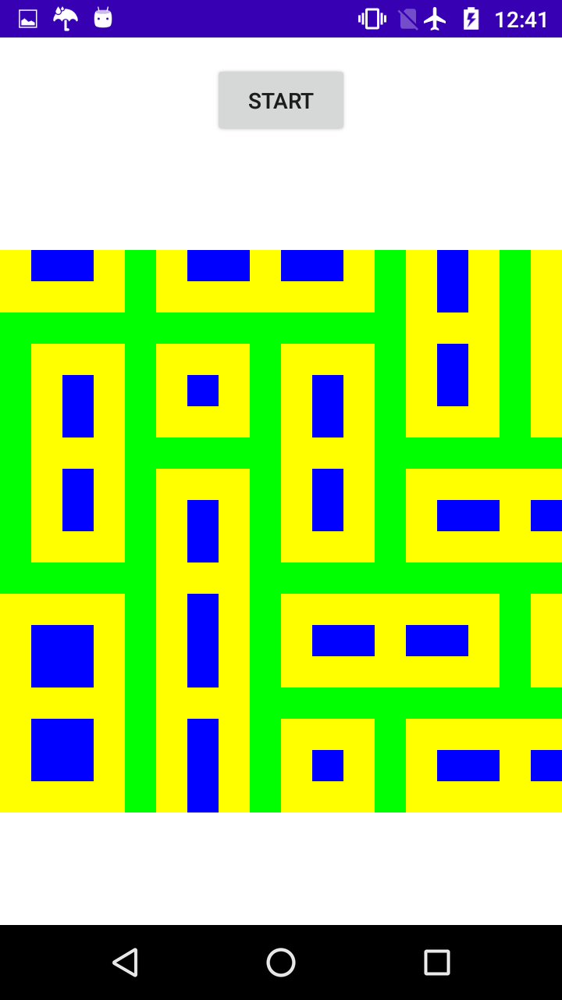

# PatternGeneratorWFC
<a href="https://github.com/mxgmn/WaveFunctionCollapse">Wave Function Collapse</a> implementation in Android

App that allows You to create custom input maps and see the result of WFC algorithm. 

# Download

<a href="download/WFC_MP_demo.apk" download>Android app</a>

# Screenshots

